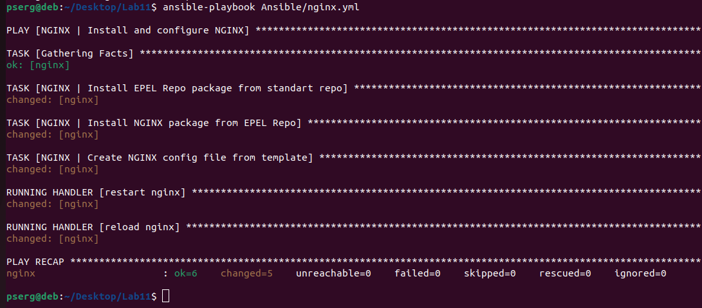
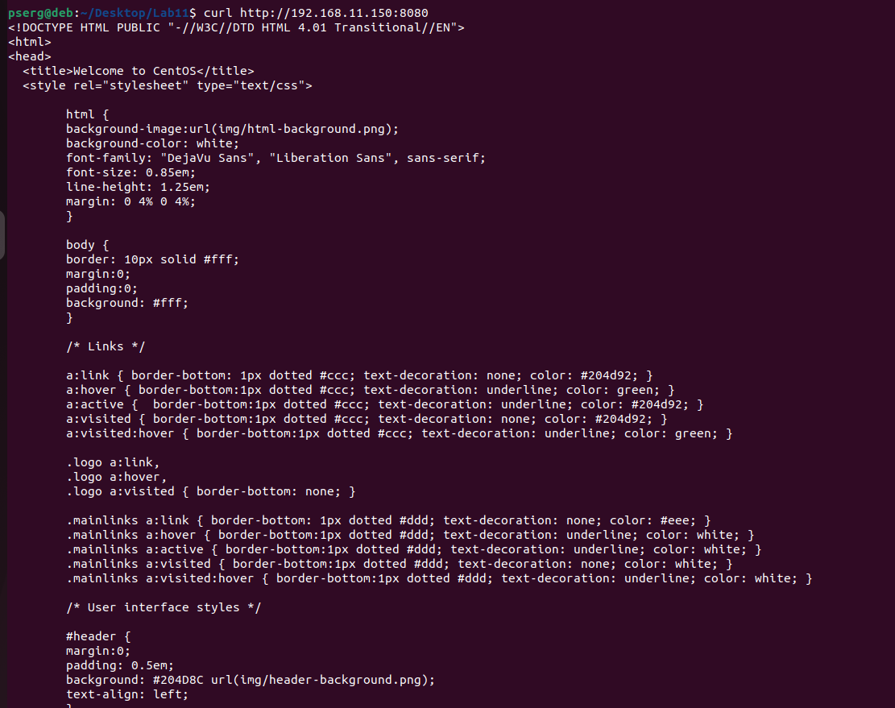

# Домашнее задание №11 "Ansible"
## Цель
1. Автоматизировать рутинные задачи администрирования используя ansible;
1. На сервере используя Ansible необходимо развернуть nginx со  следующими условиями:
    1. необходимо использовать модуль yum/apt;
    1. конфигурационные файлы должны быть взяты из шаблона jinja2 с перемененными;
    1. после установки nginx должен быть в режиме enabled в systemd;
    1. должен быть использован notify для старта nginx после установки;
    1. сайт должен слушать на нестандартном порту - 8080, для этого использовать переменные в Ansible.

## Решение
1. Настроен [Vagrantfile](./Vagrantfile) для развертывания стенда VM c Centos 7.
1. Подготовлен [playbook](./Ansible/nginx.yml) для развертывания и настройки nginx в соответствии с заданием. Для работы с виртуальной машиной созданы два конф-х файла [ansible.cfg](./ansible.cfg) и [hosts](./Ansible/hosts) с параметрами подключения.
1. Запуск стенда осуществляется командами:
    1. `vagrant up`
    1. `ansible-playbook Ansible/nginx.yml`

## Результат
Врезультате выполнения `ansible-playbook Ansible/nginx.yml` получаем рабочий стенд с настроенным nginx:

1. результат работы playbook

1. вывод работы nginx

